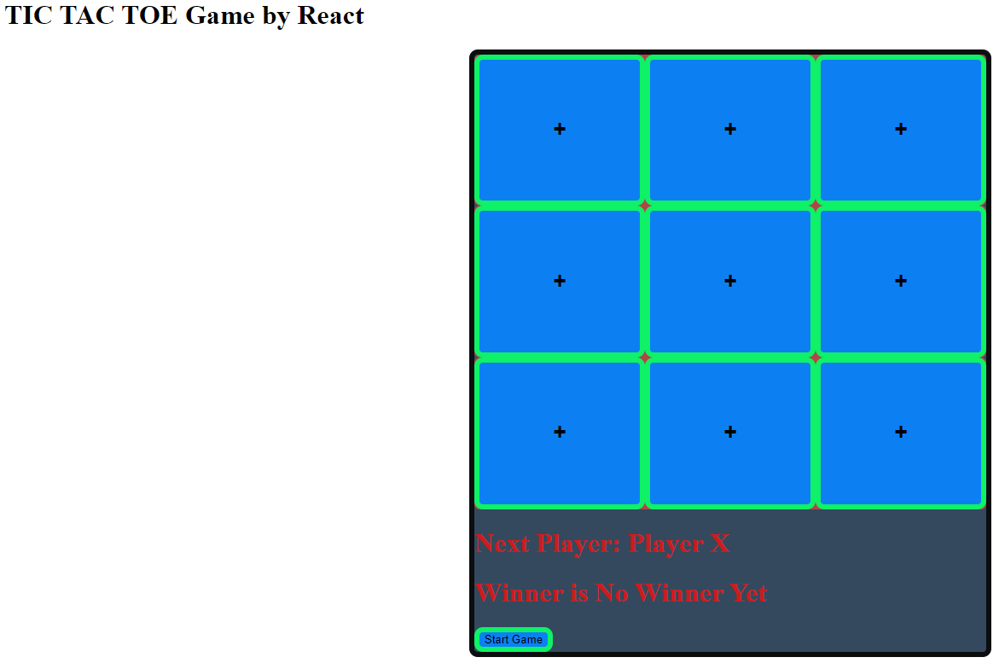
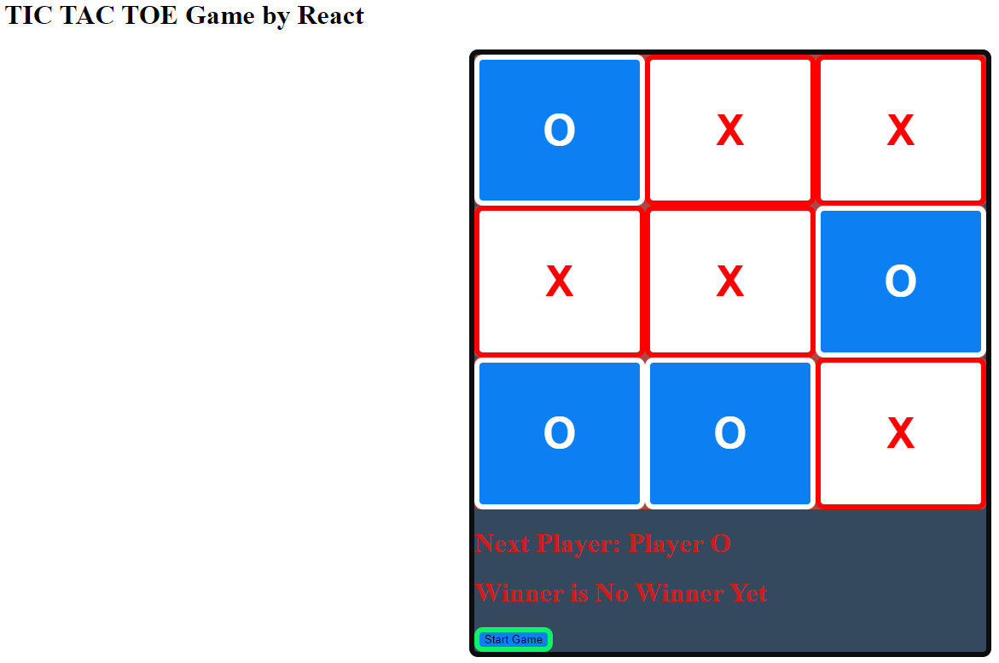

# TIC-TAC-TOE GAME
 

 
<h2>
  Description: A game of Tic Tac Toe created using React. Currently, the game has all the necessary functionality to play. Added CSS style to reflect the players with color red indicating player X and color white for player O. Additionally, once the square has been clicked, it cannot be clicked again by checking the state of the square and disable the square (button). Finally, there is a start button that will reload the entire page by using vanilla JavaScript, but it can be improved by using state.

</h2>
<h2>
  Road Map: Future improvements could include a back button to allow the player to go back one step or more. A score board to indicate who is winning. Add sound to when player clicks the square.
</h2>

